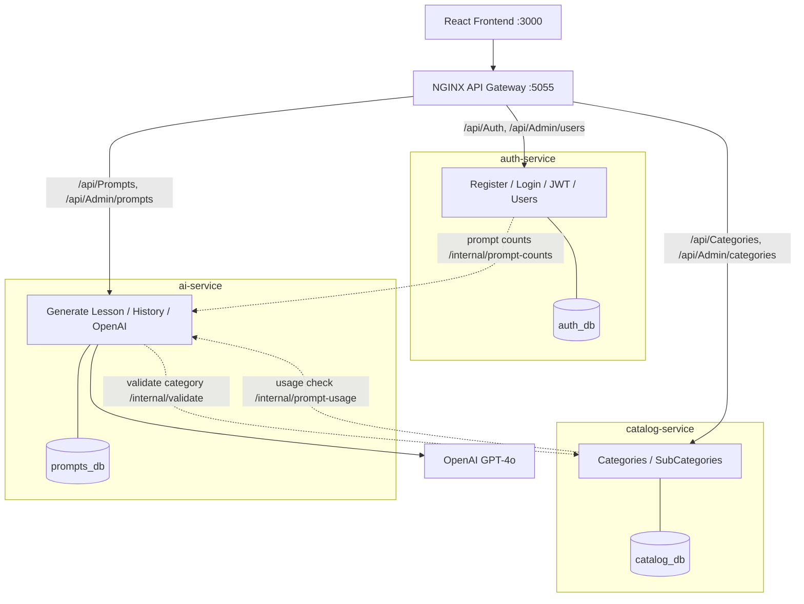

# AI Learning Platform — Microservices Architecture

> This branch (`feature/microservices`) re-architects the platform from a single
> monolithic .NET API into **independent, containerized microservices**, each owning
> its own database and communicating over HTTP through an API gateway.
>
> The `main` branch keeps the original, simpler monolithic version. This branch is the
> distributed-systems version.

---

## Why this branch exists

The original system was a clean **monolith**: one .NET API with all controllers
(`Auth`, `Categories`, `Prompts`, `Admin`) talking to a single PostgreSQL database.

This branch demonstrates the **microservices** style that production DevOps teams run:
small services, independent databases, service-to-service calls, and a gateway as the
single public entrypoint — all orchestrated with Docker Compose (and ready for Kubernetes).

---

## Services

| Service | Port | Database | Responsibility |
|---------|------|----------|----------------|
| **auth-service** | 8080 | `auth_db` | Register / login / JWT issuing, admin user list |
| **catalog-service** | 8080 | `catalog_db` | Categories & sub-categories (public + admin CRUD) |
| **ai-service** | 8080 | `prompts_db` | Lesson generation (OpenAI), prompt history, admin prompts |
| **gateway** (NGINX) | 5055 | — | Single public entrypoint; routes by URL path |
| **frontend** (React) | 3000 | — | UI — unchanged; talks only to the gateway |

Each service has its **own PostgreSQL instance** (`auth-db`, `catalog-db`, `prompts-db`) —
the *database-per-service* pattern.

---

## Architecture



---

## Gateway routing

The frontend is **unchanged** — it still calls `http://localhost:5055/api/...`.
The NGINX gateway (`gateway/nginx.conf`) routes each path to the owning service:

| Path | Routed to |
|------|-----------|
| `/api/Auth/*` | auth-service |
| `/api/Admin/users` | auth-service |
| `/api/Categories/*` | catalog-service |
| `/api/Admin/categories*`, `/api/Admin/subcategories*` | catalog-service |
| `/api/Prompts/*` | ai-service |
| `/api/Admin/prompts` | ai-service |

---

## Service-to-service communication

Because each service owns its own database, there are **no cross-database foreign keys**.
The relationships that used to be SQL `JOIN`s are now HTTP calls over an internal-only
API (`/internal/*`, never exposed through the gateway):

1. **Create a lesson** — `ai-service` calls `catalog-service` `/internal/validate` to
   confirm the category/sub-category and fetch their names, then stores them
   **denormalized** on the prompt record.
2. **Admin → users list** — `auth-service` calls `ai-service` `/internal/prompt-counts`
   to show how many prompts each user has created.
3. **Delete a category** — `catalog-service` calls `ai-service` `/internal/prompt-usage`
   to check whether any prompt still references it before deleting.

All cross-service calls **fail gracefully**: if a dependency is down, the caller degrades
(counts default to 0, deletes are allowed, lesson creation returns `503`) instead of
crashing.

---

## Run it locally

```bash
# Use the fake AI generator (no OpenAI key needed) for a quick end-to-end test:
USE_FAKE_AI=true docker compose up -d --build

# …or with a real key for actual GPT-4o lessons:
#   create a .env with OPENAI_API_KEY=sk-... and OPENAI_MODEL=gpt-4o
docker compose up -d --build
```

| URL | What |
|-----|------|
| http://localhost:3000 | Frontend |
| http://localhost:5055/health | Gateway health |
| http://localhost:5055/api/Categories | Categories (via gateway → catalog-service) |

Default admin login: `admin@admin.com` / `Admin123!`

```bash
docker compose ps          # see all services
docker compose logs -f ai-service
docker compose down        # stop
docker compose down -v     # stop and wipe the databases
```

---

## What this demonstrates (DevOps)

- **Microservices**: independent deployables, database-per-service, bounded contexts
- **API gateway**: single entrypoint, path-based routing (NGINX)
- **Service discovery**: container DNS + runtime resolution
- **Resilience**: timeouts and graceful degradation on cross-service calls
- **Shared auth**: stateless JWT issued by one service, validated by all
- **Observability-ready**: every service exposes `/health` and `/metrics`
- **Containerization & orchestration**: per-service Dockerfiles + Docker Compose

---

## Relationship to `main`

| | `main` | `feature/microservices` |
|---|--------|------------------------|
| Backend | One .NET API | Three .NET services |
| Database | One PostgreSQL | One PostgreSQL **per service** |
| Entry | API directly on :5055 | NGINX gateway on :5055 |
| Frontend | Unchanged | Unchanged |

Both are fully working. `main` is the simpler reference; this branch is the distributed version.
