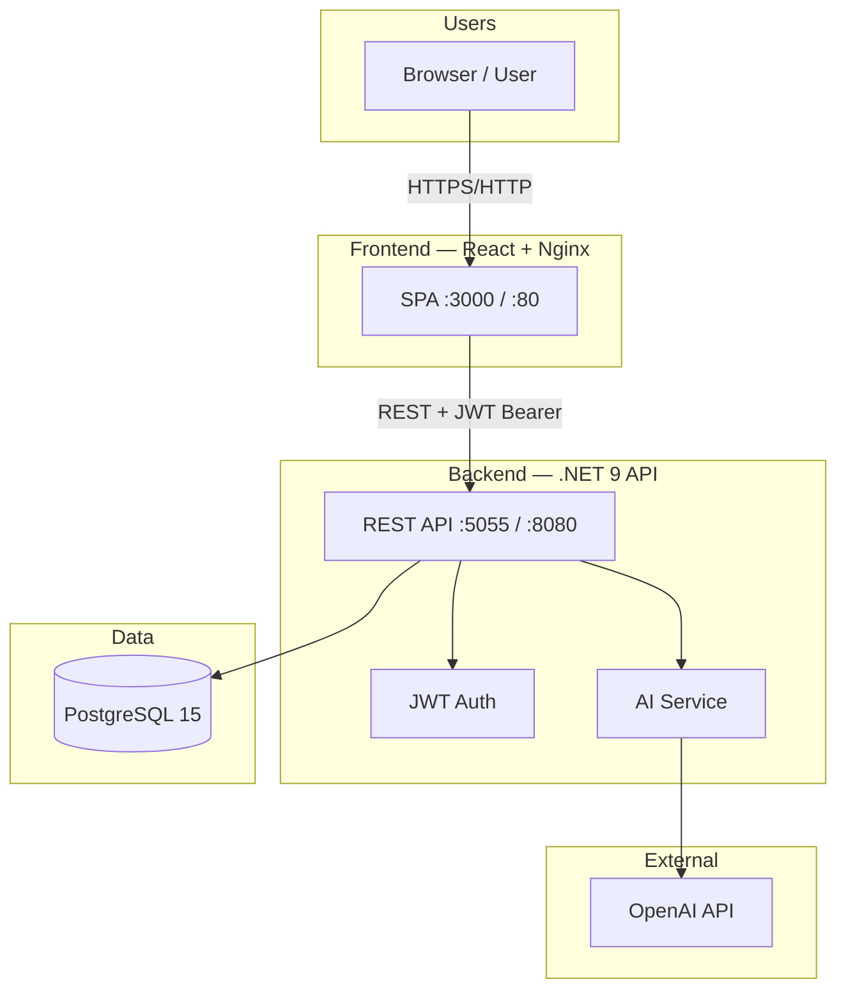
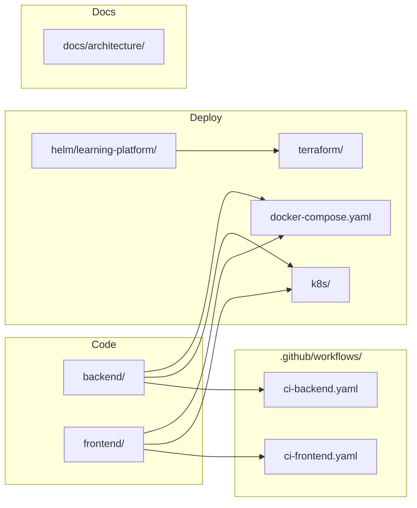
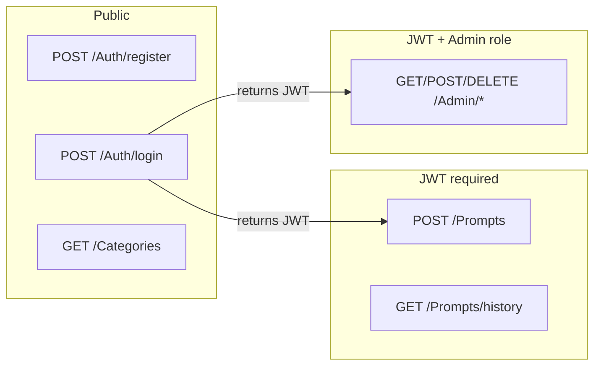

# System Overview

## High-level architecture

## Technology stack

| Layer | Technology | Role |
|-------|------------|------|
| Frontend | React 19, TypeScript, Tailwind | UI, routing, auth context |
| Backend | .NET 9, EF Core, BCrypt | REST API, business logic |
| Database | PostgreSQL 15 | Users, categories, prompts, history |
| AI | OpenAI (gpt-4o / gpt-4o-mini) | Lesson generation |
| DevOps | Docker Compose, K8s, Helm, Terraform, GitHub Actions | Build, test, deploy |

## Repository structure

## Default ports (Docker Compose)

| Service | Host port | Container port |
|---------|-----------|----------------|
| Frontend | 3000 | 80 |
| Backend API | 5055 | 8080 |
| PostgreSQL | 5434 | 5432 |
| Swagger | 5055/swagger | — |

## Security model

- Passwords hashed with **BCrypt** before storage
- JWT signed with configurable secret (`Jwt:Key` / `JWT_SECRET`)
- Admin user seeded on first startup: `admin@admin.com`
