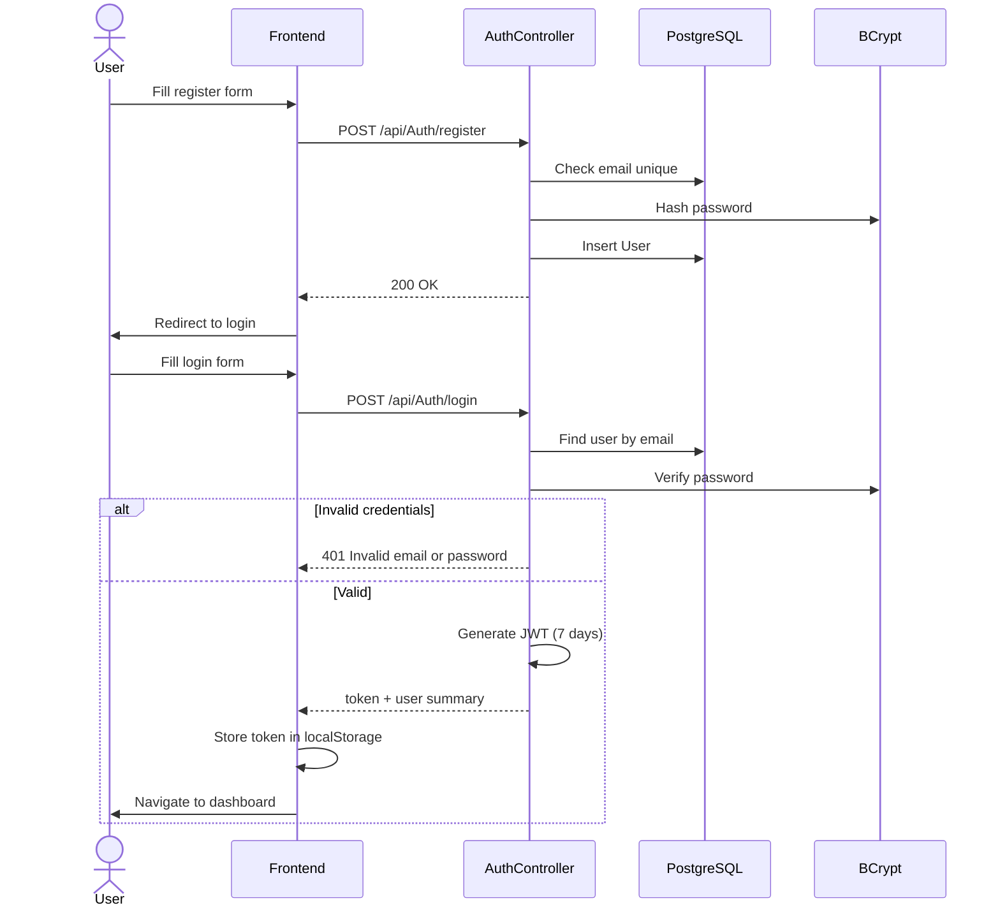
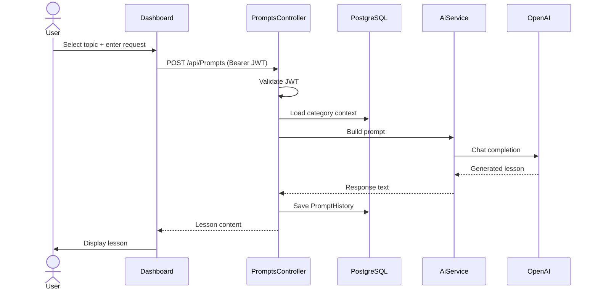
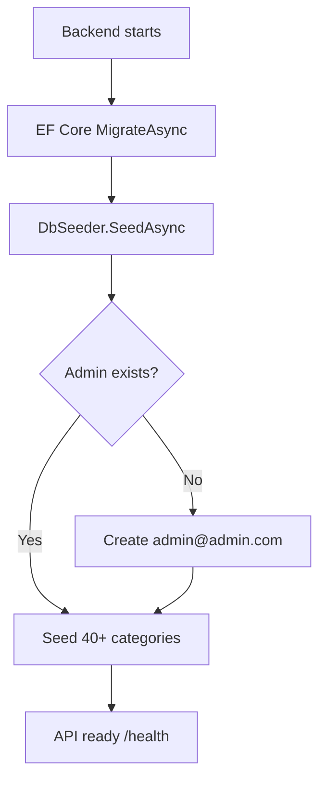

# Application Flow

## User registration & login



## AI lesson generation



## Startup & database seeding



- Migrations run in background on startup (Docker Compose)
- Categories/sub-categories loaded from `CategoriesSeedData.cs`
- Health endpoint available before seed completes

## Frontend routing

```mermaid
flowchart TD
    ROOT[/] --> LOGIN[/login]
    ROOT --> REG[/register]
    LOGIN -->|success user| DASH[/dashboard]
    LOGIN -->|success admin| ADMIN[/admin]
    DASH --> HIST[/history]
    DASH --> PR2[Generate lesson]
    ADMIN --> USR[Users tab]
    ADMIN --> PRM[Prompts tab]
    ADMIN --> CAT2[Categories tab]
```

Protected routes use `ProtectedRoute` component — redirects to `/login` if no valid JWT.
