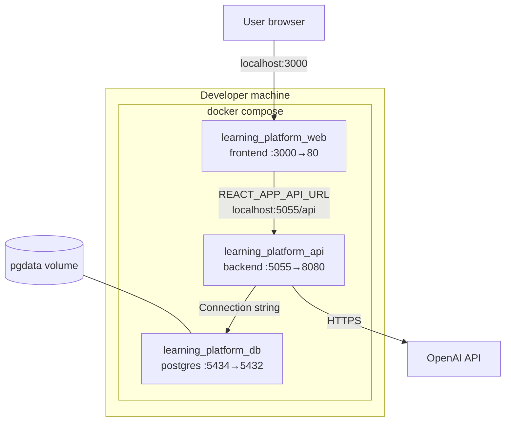
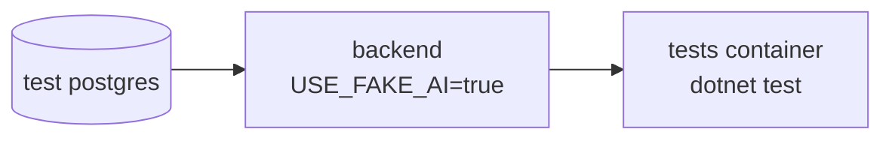

# Docker Compose Architecture

Primary deployment method for local development and project evaluation.

## Container topology



## Service dependencies


- **db** starts first; healthcheck `pg_isready`
- **backend** waits for db healthy, then starts API
- **frontend** depends on backend (no health gate)

## Environment variables

| Variable | Service | Purpose |
|----------|---------|---------|
| `OPENAI_API_KEY` | backend | OpenAI authentication |
| `OPENAI_MODEL` | backend | Model name (default gpt-4o-mini) |
| `JWT_SECRET` | backend | JWT signing key |
| `POSTGRES_*` | db | Database credentials |
| `REACT_APP_API_URL` | frontend build | API base URL |

Configuration file: `.env` (from `.env.example`)

## Integration test stack

Separate compose file: `docker-compose.test.yml`



- Uses `FakeAiService` — no OpenAI key needed
- Runs in CI backend pipeline (job: integration-tests)

## Commands

```bash
# Start
docker compose up -d --build

# Reset database
docker compose down -v && docker compose up -d --build

# Logs
docker compose logs -f backend
```
