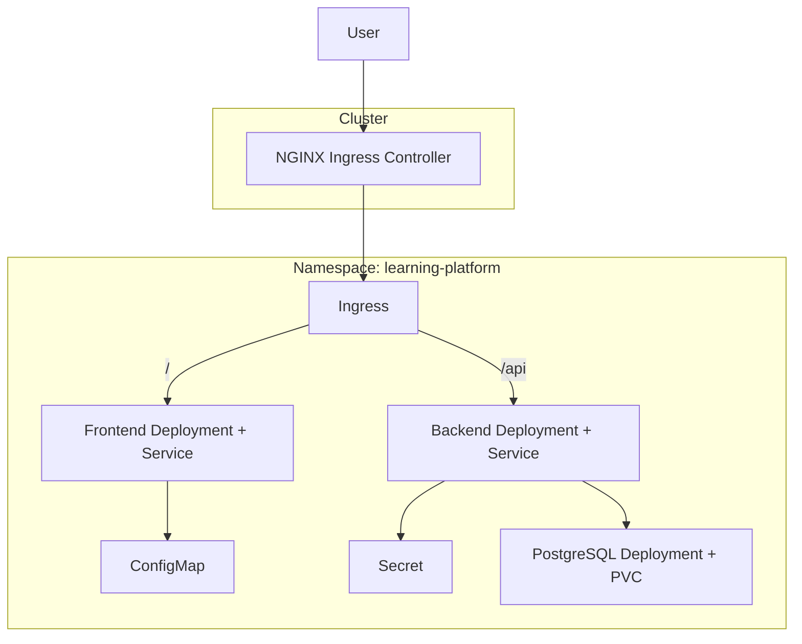
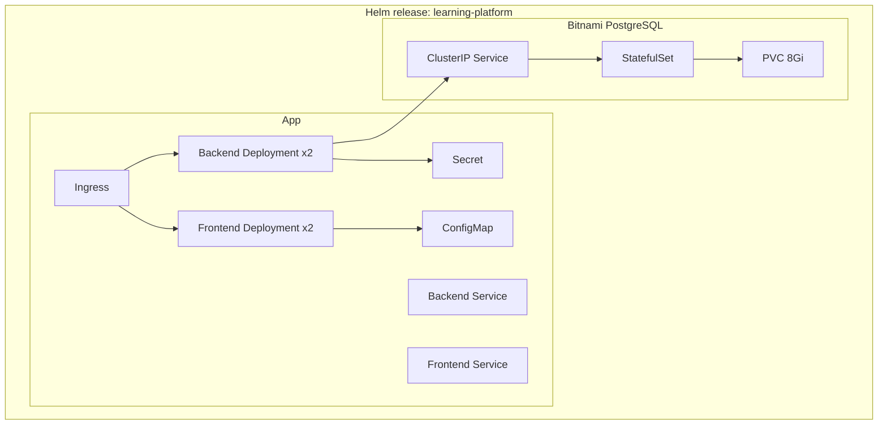
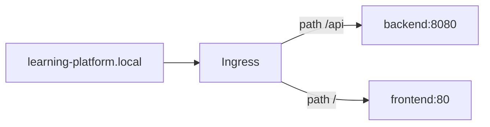

# Kubernetes & Helm Architecture

Two deployment options for Kubernetes clusters.

## Option A — Plain manifests (`k8s/`)



## Option B — Helm chart (`helm/learning-platform/`)

Recommended for production. Includes **Bitnami PostgreSQL** subchart.



## Ingress routing



Frontend built with `REACT_APP_API_URL=/api` so API calls go through the same host (no CORS issues).

## Helm values (key settings)

| Value | Default | Description |
|-------|---------|-------------|
| `secrets.openaiApiKey` | placeholder | OpenAI key |
| `secrets.jwtSecret` | placeholder | JWT secret |
| `backend.replicaCount` | 2 | API pods |
| `frontend.replicaCount` | 2 | UI pods |
| `ingress.host` | learning-platform.local | Hostname |
| `postgresql.enabled` | true | Bundled Postgres |

## Deploy with Helm

```bash
cd helm/learning-platform
helm dependency update
helm install learning-platform . \
  --namespace learning-platform \
  --create-namespace \
  --set secrets.openaiApiKey=sk-... \
  --set secrets.jwtSecret=your-secret
```

## Health checks

- Backend: `GET /health` on port 8080
- Readiness/liveness probes configured in Helm templates
- DB migrations run on backend startup (same as Compose)
