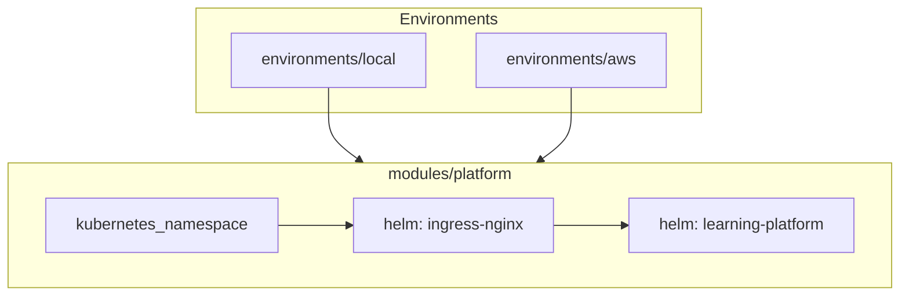
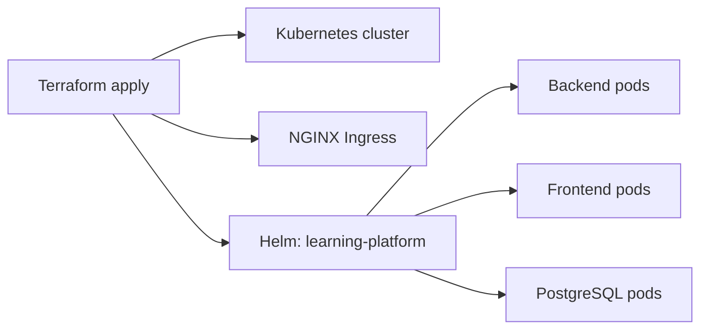
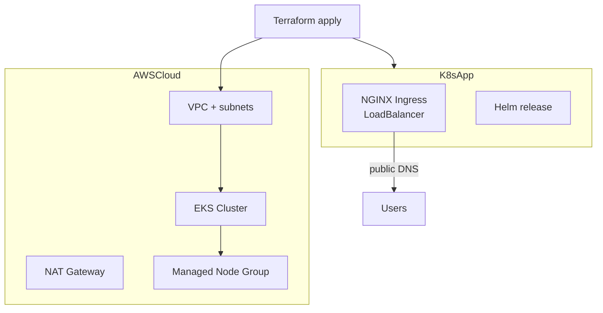
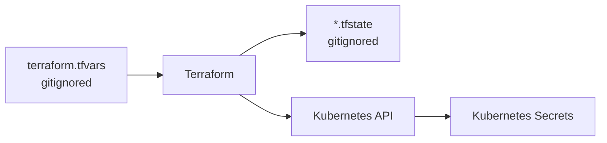

# Terraform Architecture

Infrastructure as Code layer on top of Kubernetes + Helm.

## Purpose

Terraform automates what you would otherwise run manually:

1. Create/connect to a Kubernetes cluster
2. Install NGINX Ingress Controller
3. Deploy the `helm/learning-platform` chart with secrets and image settings

## Module structure

## Local environment

Uses existing cluster (Docker Desktop K8s, minikube) or optional **kind** cluster.

| Input | Example |
|-------|---------|
| `openai_api_key` | sk-... |
| `ingress_host` | learning-platform.local |
| `backend_image_repository` | learning-platform-backend |
| `create_kind_cluster` | false (default) |

## AWS environment

Creates full cloud infrastructure:

| Resource | Module |
|----------|--------|
| VPC, subnets, NAT | `terraform-aws-modules/vpc` |
| EKS cluster + nodes | `terraform-aws-modules/eks` |
| App deployment | `modules/platform` |

## State & secrets

Never commit `terraform.tfvars` or state files with real API keys.

## Relationship to other deploy methods

| Method | Scope | Best for |
|--------|-------|----------|
| Docker Compose | Single machine | Dev, evaluation |
| k8s/ YAML | Existing cluster | Learning K8s |
| Helm | Existing cluster | Production K8s |
| Terraform | Cluster + app | Repeatable IaC, AWS EKS |

All paths deploy the **same application** — different orchestration layers.
