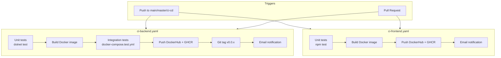
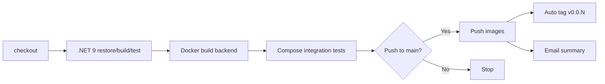
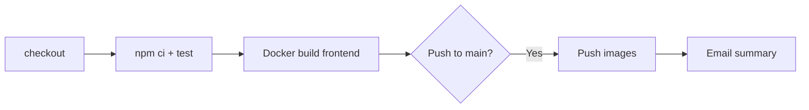
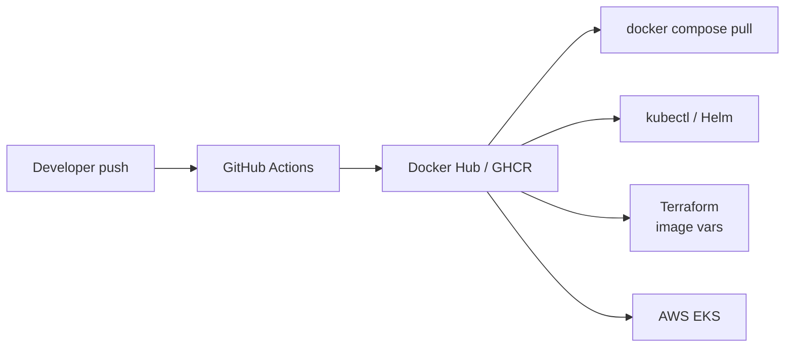

# CI/CD Pipelines

Two separate GitHub Actions workflows with **path-based triggers** — backend and frontend changes run independently.

## Pipeline overview



## Path triggers

| Workflow | Triggers when changed |
|----------|----------------------|
| `ci-backend.yaml` | `backend/**`, `tests/**`, `docker-compose.test.yml` |
| `ci-frontend.yaml` | `frontend/**` |

## Backend pipeline detail



### Image tags (on push to main)

| Registry | Tag pattern |
|----------|-------------|
| Docker Hub | `{DOCKERHUB_USERNAME}/learning-platform-backend:latest` |
| Docker Hub | `{DOCKERHUB_USERNAME}/learning-platform-backend:{sha}` |
| Docker Hub | `{DOCKERHUB_USERNAME}/learning-platform-backend:v0.0.x` |
| GHCR | `ghcr.io/EstiGenauer/ai-learning-platform/backend:latest` |

## Frontend pipeline detail



Build arg: `REACT_APP_API_URL=http://localhost:5055/api` (Compose default)

## Required GitHub Secrets

| Secret | Used by | Required |
|--------|---------|----------|
| `DOCKERHUB_USERNAME` | Both pipelines | Yes (for push) |
| `DOCKERHUB_TOKEN` | Both pipelines | Yes (for push) |
| `EMAIL_USERNAME` | Notifications | Optional |
| `EMAIL_PASSWORD` | Notifications | Optional |
| `GITHUB_TOKEN` | GHCR push | Auto-provided |

## How CI connects to deployment



1. **CI** builds and pushes Docker images on every main-branch push
2. **Docker Compose** uses locally built images (`docker compose build`)
3. **Kubernetes / Helm / Terraform** pull from registry using image repository + tag from values/tfvars

## Local testing (same as CI)

```powershell
# Backend
cd backend && dotnet test

# Frontend
cd frontend && npm test -- --watchAll=false

# Integration
docker compose -f docker-compose.test.yml up --build --abort-on-container-exit --exit-code-from tests

# All (Windows)
.\scripts\run-all-tests.ps1
```

## Notifications

Both pipelines send email via Gmail SMTP (`dawidd6/action-send-mail`) to the configured address. Fails gracefully if email secrets are not set (`continue-on-error: true`).
