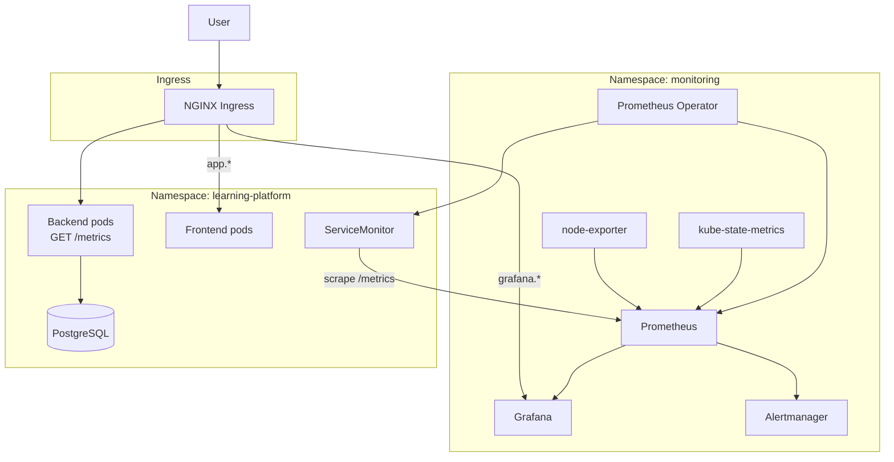
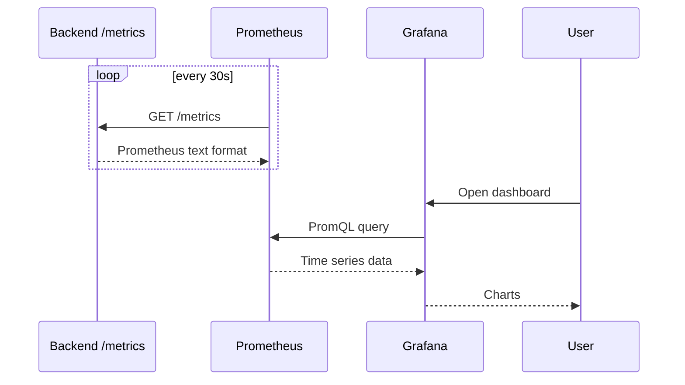

# Monitoring — Prometheus & Grafana

Observability stack for the AI Learning Platform using **kube-prometheus-stack** (official prometheus-community Helm chart).

## Architecture



## Components

| Component | Helm chart | Role |
|-----------|------------|------|
| Prometheus | kube-prometheus-stack | Scrapes & stores metrics |
| Grafana | kube-prometheus-stack | Dashboards & alerts UI |
| Alertmanager | kube-prometheus-stack | Alert routing |
| Prometheus Operator | kube-prometheus-stack | Manages ServiceMonitors |
| kube-state-metrics | kube-prometheus-stack | K8s object metrics |
| node-exporter | kube-prometheus-stack | Node CPU/RAM/disk |
| Loki | grafana/loki (Helm) | Log storage |
| Promtail | grafana/promtail (Helm) | Log shipping from pods |

## Backend metrics

The .NET API exposes OpenTelemetry metrics at **`/metrics`**:

- HTTP request rate & latency
- .NET runtime (GC, memory)
- Process metrics

Enabled in `Program.cs` via **prometheus-net** (`/metrics` endpoint + HTTP metrics middleware).

## ServiceMonitor

When `monitoring.serviceMonitor.enabled=true` in the app Helm chart, Prometheus scrapes:

```yaml
endpoints:
  - port: http
    path: /metrics
    interval: 30s
```

Requires Prometheus Operator CRDs from the monitoring stack.

## Deploy with Helm

```bash
# 1. Download dependency
cd helm/monitoring
helm repo add prometheus-community https://prometheus-community.github.io/helm-charts
helm dependency update

# 2. Install monitoring
helm install monitoring .. -n monitoring --create-namespace

# 3. Install app with scraping enabled
helm install learning-platform ../../learning-platform \
  -n learning-platform --create-namespace \
  --set monitoring.serviceMonitor.enabled=true \
  --set secrets.openaiApiKey=sk-... \
  --set secrets.jwtSecret=...
```

## Deploy with Terraform

Set `install_monitoring = true` in `terraform/environments/local/terraform.tfvars`:

```bash
cd terraform/environments/local
terraform apply
```

Terraform installs monitoring first, then the app with ServiceMonitor enabled.

## Access Grafana

Local hosts file:

```
127.0.0.1 grafana.learning-platform.local
```

URL: http://grafana.learning-platform.local  
Default login: `admin` / `admin` (change in production)

### Pre-loaded dashboards

- Kubernetes cluster / node / pod dashboards (from kube-prometheus-stack)
- **Learning Platform Overview** — custom dashboard (HTTP rate, latency, memory, logs)

See also: [Logging (Loki)](08-logging.md)

## Docker Compose (local)

```bash
docker compose --profile monitoring up -d --build
```

| URL | Service |
|-----|---------|
| http://localhost:3001 | Grafana |
| http://localhost:9090 | Prometheus |
| http://localhost:3100 | Loki |

## Metrics flow



## Useful commands

```bash
kubectl get servicemonitor -n learning-platform
kubectl get prometheus -n monitoring
kubectl port-forward -n monitoring svc/monitoring-grafana 3001:80

# Test metrics locally (Docker Compose)
curl http://localhost:5055/metrics
```

## Related files

| Path | Description |
|------|-------------|
| `helm/monitoring/` | Prometheus + Grafana Helm wrapper |
| `helm/learning-platform/templates/servicemonitor.yaml` | App scrape config |
| `terraform/modules/monitoring/` | Terraform module |
| `backend/LearningPlatformApi/Program.cs` | `/metrics` endpoint |
| `monitoring/` | Docker Compose Prometheus/Grafana/Loki configs |
