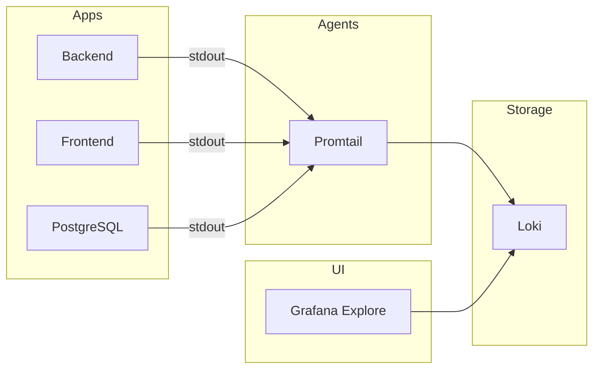

# Logging — Loki + Promtail

Centralized log aggregation for the AI Learning Platform.

## Architecture



## Docker Compose

Start app + full observability stack:

```bash
docker compose --profile monitoring up -d --build
```

| Service | URL |
|---------|-----|
| Grafana | http://localhost:3001 |
| Prometheus | http://localhost:9090 |
| Loki | http://localhost:3100 |

Promtail reads logs from the Docker socket and labels them with `service`, `container`, and `project`.

### Example Loki queries (Grafana Explore)

```logql
{service="backend"}
{service="backend"} |= "error"
{container="learning_platform_api"} |~ "(?i)exception"
```

## Kubernetes (Helm)

The `helm/monitoring` chart installs **Loki** + **Promtail** alongside Prometheus/Grafana.

Promtail ships pod logs from all namespaces. Grafana includes a **Loki** datasource pre-configured.

```bash
helm install monitoring ./helm/monitoring -n monitoring --create-namespace
```

## Backend logging

The .NET API uses **Serilog** structured console logging:

- Request logs via ASP.NET integration
- Enriched with log context
- Output → container stdout → Promtail → Loki

## Related

- [Monitoring (metrics)](07-monitoring.md)
- [`monitoring/README.md`](../../monitoring/README.md) — Docker Compose config files
- [`helm/monitoring/README.md`](../../helm/monitoring/README.md) — K8s Helm install
