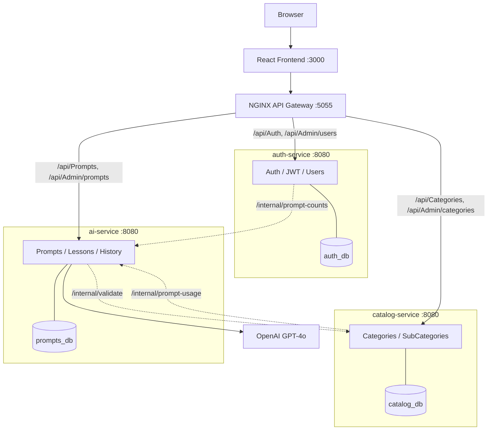
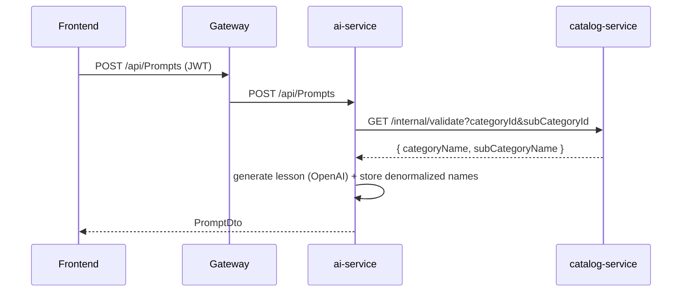

# Microservices Architecture

> Available on the `feature/microservices` branch. The `main` branch runs the original
> monolithic API; this branch splits it into independent, containerized microservices.

## Overview

The backend is split into three independently deployable .NET services, each owning its
own PostgreSQL database, fronted by an NGINX API gateway.

## Services

| Service | Owns | Database | Public routes |
|---------|------|----------|---------------|
| auth-service | Users, authentication | `auth_db` | `/api/Auth/*`, `/api/Admin/users` |
| catalog-service | Categories, sub-categories | `catalog_db` | `/api/Categories`, `/api/Admin/categories*`, `/api/Admin/subcategories*` |
| ai-service | Prompts, lesson generation | `prompts_db` | `/api/Prompts*`, `/api/Admin/prompts` |

## API gateway routing

The React frontend is unchanged — it still calls `http://localhost:5055/api/...`. The
gateway (`gateway/nginx.conf`) routes each path to the owning service. Admin endpoints are
split across services by the data they touch.

## Service-to-service communication

With a database per service there are no cross-database foreign keys. The relationships
that were SQL `JOIN`s in the monolith become HTTP calls on an internal-only API
(`/internal/*`, never exposed through the gateway):

| Call | From → To | Purpose |
|------|-----------|---------|
| `/internal/validate` | ai → catalog | Validate selection & fetch names before generating a lesson |
| `/internal/prompt-counts` | auth → ai | Prompt count per user for the admin users list |
| `/internal/prompt-usage` | catalog → ai | Block deleting a category/sub-category still in use |

All cross-service calls have timeouts and **degrade gracefully** if a dependency is down
(counts default to 0, deletes are allowed, lesson creation returns `503`).

## Data ownership trade-off

`ai-service` stores `CategoryName`, `SubCategoryName` and `UserName` **denormalized** on
each prompt (captured at creation time), because it cannot join across the other services'
databases. This is the standard microservices trade-off: data duplication in exchange for
service independence.

## Deployment

- **Docker Compose** — `docker compose up -d --build` brings up 3 databases, 3 services,
  the gateway and the frontend. Set `USE_FAKE_AI=true` to run without an OpenAI key.
- **Kubernetes** — `k8s/` contains a Deployment + Service per microservice, a
  Deployment + PVC + Service per database, the gateway (Deployment + ConfigMap + Service),
  and an Ingress that routes `/api` to the gateway and `/` to the frontend.
- **CI/CD** — `.github/workflows/ci-microservices.yaml` builds and tests all three services
  in a matrix, runs a full docker-compose integration smoke test, and pushes images to
  Docker Hub and GHCR.

## Follow-ups (not yet converted on this branch)

- The Helm chart (`helm/learning-platform`) and Terraform monitoring module still describe
  the monolith; converting them to the multi-service layout is a natural next step.
